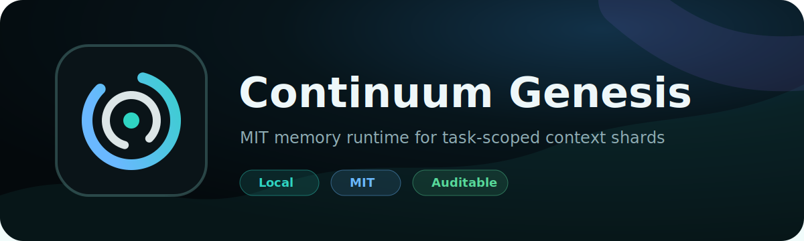

<p align="center">
  
</p>

<p align="center">
  <a href="./LICENSE"></a>
  
  
</p>

# Continuum Genesis

Continuum Genesis is an MIT reference implementation of task-scoped AI memory.

It gives developers a small local runtime, a public shard format, a JavaScript SDK, an installable text cockpit, and a repeatable evaluation harness. The goal is simple: store durable project facts, retrieve only what a task needs, and hand a compact context shard to a model or workflow.

## Core Ideas

- **Task-scoped context**: retrieve a small shard instead of re-sending a whole project.
- **Inspectable memory**: memory items are plain JSON and can be reviewed before use.
- **Local-first runtime**: the reference service runs on `127.0.0.1` with no cloud account or API key.
- **Portable interface**: the text cockpit can run in a browser or install as a PWA.
- **Measured behavior**: the evaluation harness separates the naked benchmark from native model-memory comparisons.

## Quick Start

```powershell
npm install
npm run seed
npm start
```

Open `http://127.0.0.1:8787/` and try the text cockpit.

The cockpit is installable as a PWA when served by the local runtime.

Build a shard from the command line:

```powershell
npm run shard -- --query "What should the follow-up email remember?"
```

Run checks:

```powershell
npm test
npm run leak:check
npm run security:triple
```

Run the comparison harness. The naked/no-memory run is the floor benchmark. Add a captured native model-memory result file when comparing model memory against Continuum shards:

```powershell
npm run eval:memory
npm run eval:memory -- --model-memory examples/evaluation/model-memory-results.sample.json
```

## Architecture

```text
apps/text-cockpit/        installable browser interface
packages/memory-runtime/  local file-backed HTTP runtime
packages/shard-format/    memory item and shard helpers
packages/sdk-js/          JavaScript client
examples/                 safe seed data and evaluation shape
tests/                    runtime, PWA, and release-safety checks
docs/                     protocol, setup, boundary, and release notes
```

## Public Boundary

Genesis is the open memory layer: protocol, shard format, reference runtime, SDK, and local cockpit. Managed Continuum adds production hosting, security review, isolation, stronger routing, business integrations, monitoring, and support.

Use Genesis freely for local prototypes and research. Move to managed protocols before storing sensitive business records, customer data, regulated information, or operational memory that requires access control and audit discipline.

## Security Posture

Before every public push, run:

```powershell
npm run security:triple
```

The release gate runs unit tests, leak checks, and a release-shape scan for local paths, provider key patterns, private runtime markers, customer-data markers, and service-worker caching mistakes.

See [SECURITY.md](SECURITY.md), [docs/public-private-boundary.md](docs/public-private-boundary.md), and [docs/release-checklist.md](docs/release-checklist.md).

## Related Public Tools

- [Plainsight](https://github.com/clearframeworks/plainsight) - MIT, device-local document risk reader.
- [Throughline](https://github.com/clearframeworks/throughline) - MIT public archive of EVAN's first public venture.

## License

MIT. Copyright ClearFrameworks LLC.
